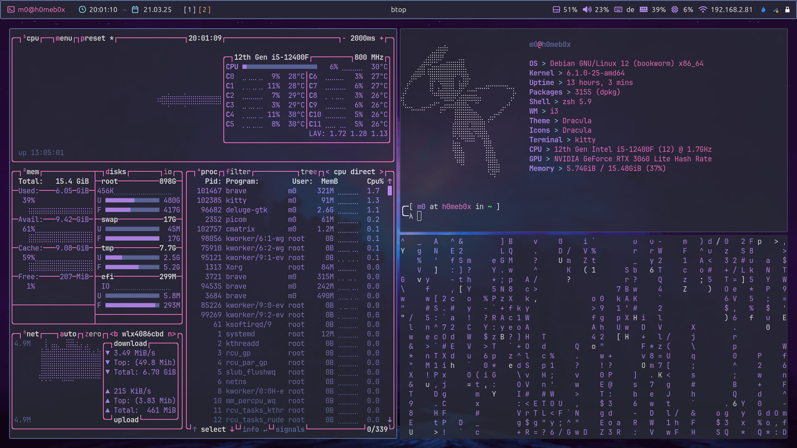

# Repository for my personal dotfiles



Configuration files are found in `.config`, it might be hidden lol

## My setup

- Operating system: `Debian 12 GNU/Linux (Bookworm) x86_64`
- DE / WM: `xfce` (default with OS) / `i3` + `picom` (alternative)
- Shell: `zsh` / `bash`
- Terminal: `kitty`
- GUI: `gtk-2.0` / `gtk-3.0`
- Theme: `dracula`
- Bar: `polybar`
- Text editor: `lazyvim` (`nvim` + `lazy`)
- Application launcher: `rofi`
- File manager: `nemo`
- Lock: `i3lock-color` (`i3lock` fork) with custom lock script
- Browser: `Brave`

### Dependencies

Install all mentioned packages from above via `apt`.
Some stuff needs to be installed otherwise, to be continued.

```bash
sudo apt install -y zsh kitty neovim rofi nemo picom i3
```

## Detailed break-down

### Terminal

- Configuration file: `~/.config/kitty/kitty.conf`
- Documentation: <https://sw.kovidgoyal.net/kitty/conf/>

### Theme

- Documentation: <https://draculatheme.com/>

### Text editor

- Configuration files: `~/.config/nvim/`
- Documentation (`lazyvim`): <https://www.lazyvim.org/>
- Documentation (`nvim`): <https://neovim.io/doc/>
